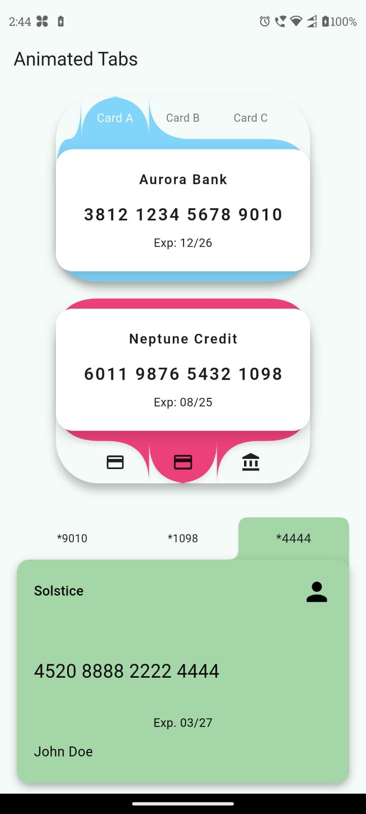
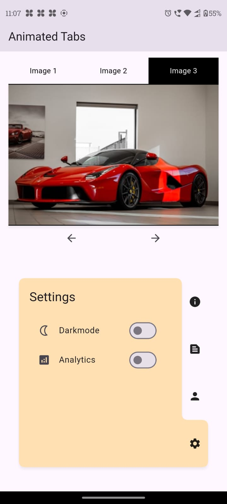
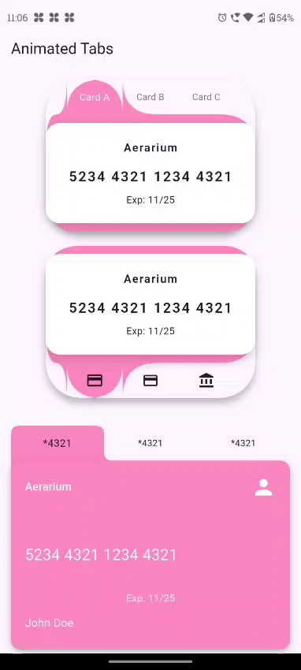

# my_animated_tabs

A highly-customizable Flutter `TabContainer` widget with buttery-smooth animated transitions.

---

## Features

- **Pill-style**, **slide**, **fade** and **pop** transitions
- Supports **top**, **bottom**, **left**, **right** tab edges
- Customizable **colors**, **border radii**, **text styles**, **transition curves**
- Zero dependencies except the Flutter SDK

---

## 📸 Screenshots & Demo

| Card style example | Bottom-tabs example |
|--------------------|---------------------|
|  |  |

&nbsp;

### 🎬 Live animation



## Installation

In your app’s `pubspec.yaml`:

```yaml
dependencies:
  flutter:
    sdk: flutter
  my_animated_tabs: ^1.0.0


